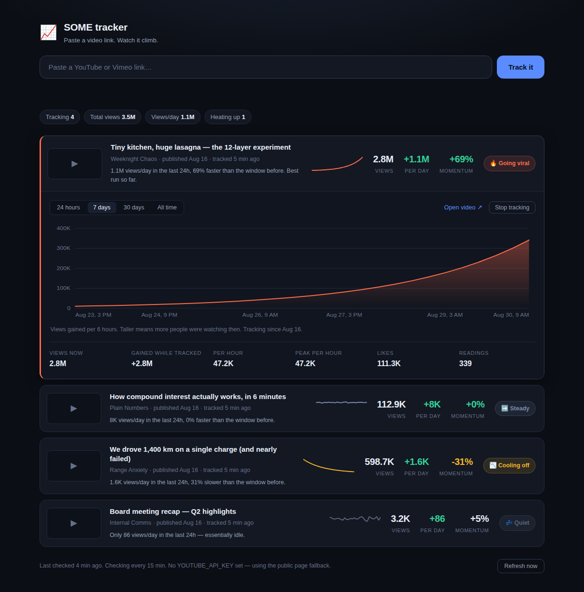

# SOME tracker

Paste a video link. See how it is doing at a glance.

One field at the top, one dashboard underneath. Each tracked video shows its
current view count, whether it is taking off or calming down right now, and a
curve of when people were actually watching it.



## Quick start

Needs Node 22.5 or newer. There is nothing to install — no dependencies.

```bash
npm start                 # http://localhost:3000
```

Want to see what a full dashboard looks like before collecting real data?

```bash
npm run seed              # four demo videos with two weeks of history
npm start
```

## Reading the dashboard

Each card answers three questions.

| | |
|---|---|
| **Views** | The total right now. |
| **Per day** | How fast it is gaining views over the last 24 hours. |
| **Momentum** | That rate compared with the 24 hours before it. `+120%` means it is picking up more than twice as fast as yesterday. |

The badge turns that into a verdict:

| Badge | Meaning |
|---|---|
| 🔥 **Going viral** | Gaining at least 50% faster than the window before, *and* running at its own best pace. |
| 📈 **Picking up** | Noticeably faster than the window before. |
| ➡️ **Steady** | Holding roughly the same pace. |
| 📉 **Cooling off** | Clearly slowing down — the spike has passed. |
| 💤 **Quiet** | Under ~120 views/day. Nothing is happening. |
| ⏳ **Warming up** | Fewer than two hours of readings, so no honest verdict yet. |

"Viral" is judged against the video's own history, not a global threshold, so a
niche clip having its best week reads as hot without needing millions of views.

Click any card to open the curve. It plots **views gained per interval**, not the
running total — the peaks are the moments people were actually watching, and the
dips are the quiet stretches. Switch between 24 hours, 7 days, 30 days and all
time, and hover for exact numbers.

## Reading YouTube without an API key

No key is needed. The tracker tries three routes in order and uses the first
that answers:

1. **The public watch page.** One request, and the count is usually right
   there in the page.
2. **YouTube's own player endpoint.** If the page renders without a count, the
   tracker reads the public client key *out of the page it just fetched* and
   calls the same endpoint youtube.com's player calls. Nothing is hardcoded,
   so a rotation on YouTube's side fixes itself rather than breaking polling.
3. **A Piped instance**, if you set `PIPED_API`. Off by default.

Requests carry consent cookies and a pinned region, which is what stops
YouTube answering with the EU consent page instead of the video.

**Check whether it works from a given machine before relying on it:**

```bash
npm run check                  # a known-good video
npm run check -- <video-url>   # a specific one
```

It reports which route answered, or why none did.

### If the no-key route gets blocked

YouTube treats datacenter addresses more suspiciously than home ones, so a CI
runner or a VPS may get a consent page or a bot check where your laptop does
not. The tracker names which of those happened instead of reporting a bare
failure, and the polling workflow runs the same diagnostic automatically when
a run fails.

Three ways out, cheapest first:

- **Run the poller somewhere else.** The same `scripts/poll.js` — or the whole
  Node app — works from your own machine or a small box at home.
- **Set `PIPED_API`** to a working [Piped](https://github.com/TeamPiped/Piped)
  instance: as a repository *variable* for the Action (Settings → Secrets and
  variables → Actions → Variables), or an environment variable locally. Public
  instances come and go, so treat it as a fallback, not a foundation.
- **Set `YOUTUBE_API_KEY`.** Still the most reliable option if you can get one
  ([console.cloud.google.com](https://console.cloud.google.com/) → enable
  *YouTube Data API v3* → create an API key). It is free, and with it every
  tracked video is fetched in a single batched request.

Vimeo needs no key and no fallbacks.

## How history is collected

**The curve starts when you add the link.** Neither YouTube nor Vimeo will tell
you what a video's views were last Tuesday, so the app builds history by taking
its own readings — every 15 minutes while the server is running. Leave it
running and the curve fills in; a card needs a couple of hours before it can say
anything about momentum.

Readings are stored in SQLite at `data/tracker.db`. Nothing leaves your machine
except the requests to YouTube and Vimeo.

## Deploying it

The app needs two things from a host, and they rule out most of the obvious
choices:

- **An always-on process.** History exists only because the poller keeps taking
  readings. Serverless platforms (Vercel, Netlify, Cloudflare Workers) only run
  code while a request is in flight, so the poller would never run and the
  dashboard would stay empty.
- **A persistent disk.** The curves live in SQLite. On a platform with an
  ephemeral filesystem, every deploy silently starts them over.

The same trap exists on hosts that *do* fit: free tiers that sleep after
inactivity, and Fly's `auto_stop_machines`, both stop the poller and leave gaps
in the curves. Keep the instance awake.

Everything below assumes Docker. There are no dependencies to install, so the
image is small and the build is a copy.

### GitHub Pages + Actions (no server, free)

This is the one option that needs no host at all: a scheduled Action takes the
readings and commits them, the repo *is* the database, and Pages serves the
dashboard. On a public repository [Actions on standard runners is free](https://docs.github.com/en/billing/reference/actions-runner-pricing),
so this costs nothing to run.

**Setup, once:**

1. **Settings → Pages → Source: GitHub Actions.** (Only you can do this — it
   cannot be enabled from a workflow.)
2. Push to `main`. The dashboard deploys to
   `https://<you>.github.io/<repo>/`, and the poller starts on its schedule.
3. Open the dashboard, click **Connect**, and paste a
   [fine-grained token](https://github.com/settings/personal-access-tokens/new)
   scoped to this repository with **Contents: read and write** (add
   **Actions: read and write** to have new videos read immediately rather than
   at the next quarter hour).

After that it behaves like the server version: paste a link, get a card.

**How it works.** Adding a video commits to `data/videos.json` from your
browser. The scheduled workflow reads that list, fetches the counts and appends
to `data/history.json`. The dashboard fetches both files and runs the *same*
`lib/metrics.js` in your browser that the Node app runs on the server — one
copy of the analysis, wrapped for the browser at build time by
`scripts/build-site.js`.

Preview it locally before pushing:

```bash
npm run preview:site      # http://localhost:4111
```

**What to know before choosing this:**

- **A public repo is a public tracker.** The list of videos you track and their
  full view history are readable by anyone. The token is not — it stays in your
  browser's local storage and is never committed.
- **No API key is needed**, but the no-key route reads a public page that a CI
  address can be blocked from — see the section above, and run `npm run check`
  before relying on it. The workflow diagnoses this for you when a run fails.
- **Scheduled runs are best-effort.** GitHub delays them under load and
  sometimes skips them, so readings land unevenly. The analysis interpolates
  between readings rather than assuming a fixed spacing, so curves stay
  correct — just sampled a little raggedly.
- **On a private repo**, the [2,000 free minutes/month](https://docs.github.com/billing/managing-billing-for-github-actions/about-billing-for-github-actions)
  cap this: each run bills as a whole minute, so 15-minute polling costs ~2,880
  minutes. Change the cron in `.github/workflows/poll.yml` to `0,30 * * * *`
  to fit.
- **History is pruned** to keep the repo small: every reading for 14 days, then
  one per 6 hours. A tracked video settles at roughly 20 KB.

### A VPS, home server or Raspberry Pi

The cheapest option, and the app is small enough for the smallest box.

```bash
YOUTUBE_API_KEY=your-key APP_PASSWORD=something-secret docker compose up -d
```

Then put it behind Caddy, nginx or a Tailscale/Cloudflare tunnel for HTTPS.

### Fly.io

```bash
fly launch --no-deploy               # sets app name and region in fly.toml
fly volumes create tracker_data --size 1
fly secrets set YOUTUBE_API_KEY=your-key APP_PASSWORD=something-secret
fly deploy
```

`fly.toml` already pins the machine awake, which is what keeps readings
continuous.

### Render

Point a new Blueprint at this repo — `render.yaml` describes the service, its
disk and its health check. Set `YOUTUBE_API_KEY` and `APP_PASSWORD` in the
dashboard. Use a paid instance: free ones sleep, and a sleeping tracker is not
tracking.

### Locking it down

Anything reachable from the internet should set `APP_PASSWORD`. Without it the
dashboard is open to anyone who finds the URL — they can add and delete videos
and burn through your API quota.

```bash
APP_PASSWORD=something-secret npm start
```

The browser then asks for a password (leave the username blank). `/api/health`
stays open so container health checks keep working.

## Configuration

| Variable | Default | |
|---|---|---|
| `PORT` | `3000` | Port to serve on. |
| `YOUTUBE_API_KEY` | *(none)* | Optional. Most reliable, and enables batching. |
| `PIPED_API` | *(none)* | Optional fallback when the public page is blocked. |
| `POLL_INTERVAL_MINUTES` | `15` | How often to take a reading. |
| `DB_PATH` | `data/tracker.db` | Where history is stored. |
| `APP_PASSWORD` | *(none)* | Require a password. Set this if it is reachable from the internet. |
| `HOST` | `0.0.0.0` | Interface to bind. |

## Supported links

YouTube (`watch?v=`, `youtu.be/`, `/shorts/`, `/embed/`, `/live/`) and Vimeo.
Anything else is rejected with a message rather than added as a dead card.

## API

| | |
|---|---|
| `GET /api/videos` | Every tracked video with its current analysis. |
| `POST /api/videos` | `{"url": "..."}` — add a link. |
| `DELETE /api/videos/:id` | Stop tracking and delete its history. |
| `GET /api/videos/:id/series?range=24h\|7d\|30d\|all` | Chart buckets. |
| `POST /api/refresh` | Take a reading now. |
| `GET /api/health` | Status, tracked count, poller state. |

## Layout

```
server.js          HTTP server and JSON API
seed.js            demo data
lib/db.js          SQLite schema and queries
lib/providers.js   link parsing and stat fetching
lib/metrics.js     velocity, momentum and the viral verdict (shared)
lib/dashboard.js   the dashboard UI, shared by both frontends
lib/parse-link.js  URL parsing, shared by both frontends
lib/poller.js      the background reading loop
public/            the dashboard (no build step, no framework)
site/              the static dashboard (GitHub Pages build)
scripts/poll.js    the poller that runs as a GitHub Action
scripts/build-site.js  assembles site/ + lib/ into _site/
scripts/check-source.js  can this machine read view counts?
test/              node --test suite
data/*.json        tracked list and readings (the GitHub build's database)
Dockerfile         container image
docker-compose.yml self-hosting on your own box
fly.toml           Fly.io config
render.yaml        Render blueprint
```
